# Openstrap Edge

> **Personal-fork status:** This checkout preserves the upstream-capable app, but Akshat's active
> personal target is an iPhone-only minimal release/AOT IPA installed directly with Sideloadly. Its
> deterministic build profile and public manual workflow produced the accepted build `0.9.37` build
> `70` (installed over build 69; Akshat confirmed the phone check and current-version refresh
> enrollment). It is cached in `final-ipas/whoop/backup`; `testing` holds the validated build-74 candidate.
> `0.9.32` build `65` was installed after a clean same-identity reinstall and verified
> encrypted restore; Akshat confirmed the recovered app works. It does not import
> Apple Health’s aggregate: the minimal personal profile excludes
> HealthKit and queries the direct phone pedometer only. Device testing verified step import after
> enabling **This phone → Steps**; the earlier roughly-200 count was the band fallback. Keep phone
> steps enabled for normal iPhone-carried use: WHOOP 4 band-only historical data is too low-rate for
> honest all-day step reconstruction. The personal profile
> excludes Watch, general/home/breathing widgets, App Groups, and HealthKit, and scheduled
> processing/fetch, while retaining the phone app and CoreBluetooth restoration. Build 63 excludes
> GPS. The uninstalled `0.9.31` build `64` artifact is superseded. Build `65`
> reopens GPS, hides the unsupported Oura row, and adds confirmed-phone-stillness filtering for
> wrist step noise. Its macOS build, local artifact validation, clean installation, encrypted
> restore, launch, data, scheduled enrollment, and exact-final-ID same-app refresh gates pass. The
> install stall once blamed on automatic bundle-ID rewriting happens in both modes; opening WHOOP
> and swiping it away releases a stuck install (cause not established). The exact ID
> `com.akshat.personal.whoop.5564K8D4SV` preserves data and pairing while advancing signing. A
> controlled forced-due unattended Wi-Fi daemon cycle also passes; the next naturally elapsed cycle
> and remaining GPS/background checks remain open — see `CLAUDE.md`.
> Accepted `0.9.37`/`70` adds the MyFitnessPal-style Food diary, maintenance history with body
> weight, phone-first steps, a cleaner Sleep screen, run medals and voice cues, and the 30-day
> chart touch fix (`CLAUDE.md`, `metrics-map.md`).
> Source `0.9.39`/`72` implements the approved UI and food cleanup: wrapping chart readouts,
> monthly history, Today on fresh launch, My foods by default, direct scanning, editable Quick add
> with optional fibre, honest weekly coverage and automatic card refresh. Save/date races and
> retryable failures have regressions. Algorithm 88 corrects movement calendar age across DST.
> Source also repairs Today refresh: phone steps first, measured counts shared with detail/chart
> reads and visible timeout/failure feedback. The initial UI/food CI and IPA build passed, but that
> artifact predates this repair and is superseded. Source `05c208c7` is published; local release
> checks, Linux CI, the macOS build, downloaded checksum and payload validation pass. Build 72 is
> previously installed, confirmed by Akshat, but was not phone-accepted and its testing artifact is superseded.
> `workout-sync-audit.md` records reported sync/background voice,
> calorie consistency, macro visibility and profile issues plus the approved step-goal streak extension;
> the approved repairs are implemented in source `0.9.40`/`73` (algorithm 89) and pass
> local validation. Build 73 adds background audio for spoken workout cues, shared movement/calorie
> refresh, step-goal streaks, precise profile/serving units and keyboard-safe food controls.
> Nap corrections update immediately, with coaching rebuilt in the background and Naps reachable
> when empty. Trends opens Week, reuses full daily charts, and separates step calories from steps.
> Source `a49d7837` is published with Akshat's approval; Linux CI, the personal macOS build,
> downloaded checksum and payload validation pass. Build 73 is installed, confirmed by Akshat,
> but was not accepted; its testing artifact is superseded by build 74.
> `build-74-audit.md` records remaining chart/navigation/notification issues, calorie-model research
> and the implemented build-74 contract. Source `0.9.41`/`74` (algorithm 90) adds the persistent
> Budget/ACSM pair, motion-distance coverage, graph/navigation repairs, focused notifications,
> opt-in training review with matched context and best-effort evidence, live cadence/context
> tags, qualified HR drift and one workout-only Live Activity extension without App Groups.
> Foreground refresh re-reads session movement; deletion/Undo notices expire after two seconds.
> Scan is beside My foods → New. Both scan entry points open editable nutrition review;
> only the meal portion screen’s explicit Log writes a diary entry. The replacement IPA includes it.
> Budget coefficients are unchanged. Local release checks pass (3,343 full-suite tests, 107 personal
> checks and eight iOS contract tests; analysis has no errors/warnings). Source `ba5bb29f` is
> published with approval; Linux CI `37397127258` (test-only fix `fa16be3c`, identical app inputs)
> and personal macOS build `37395690305` pass.
> Build 74 is installed but superseded by build `0.9.42`/`75` (`1c203f17`): shared Trends ranges
> and dated metric links, Food ordering/review/sub-headings/measures, a quieter day breakdown,
> battery on Today and Live Activity diagnostics (`build-75-audit.md`). Its Linux CI and personal
> macOS build pass. Build 75 is installed; build `0.9.43`/`76` (`3f8ada60`) adds its food
> follow-ups (clean edit numbers, ±1 hold-to-repeat steppers, drag between sub-headings, eaten /
> goal Calories card); build `0.9.44`/`77` (`2602cacf`) adds its polish; build `0.9.45`/`78` (`1eae1fbc`) adds two-unit portions, compact Train history and conservative workout calories; build `0.9.46`/`79` (`4b7f5918`) adds pack-printed servings ("6 piece · 85 g"); build `0.9.47`/`80` (`6dd75b2b`) gives the food editor one aligned serving line; build `0.9.48`/`81` (`d44c989f`) adds sleep to recovery, Quick add weight, patterns from logged data and bedtime consistency, and drops the Live Activity; build `0.9.49`/`82` (`4b53abbe`) adds page-scrolling drag, a discard guard, Foods search, saved-meal flow fixes and the iPhone app log; build `0.9.50`/`83` (`cbaf93cd`) time-stamps that log and makes the history sync ask the band. Its CI and macOS build pass; the downloaded IPA is the sole candidate in
> `final-ipas/whoop/testing/WHOOP-0.9.50-build83-cbaf93cd`, not yet installed. Installation, phone acceptance and
> current-version refresh enrollment remain pending. `todo.md` owns device gates.
> Build 70 remains
> the accepted recovery build (`todo.md`, `setup.md`).
> Superseded `0.9.36`/`69` adds run calories by distance and by heart rate, a Running row in
> maintenance, runs measured by the phone when there was no GPS, a run-or-walk streak, chart finger
> cursors and pull to refresh; its phone check passed as part of build 70's (`metrics-map.md`).
> Superseded `0.9.35`/`68` was installed over build 67; its first run screen was phone-confirmed.
> It adds maintenance
> calories, a dark-only palette, a Strava-style run screen with Apple Maps, running trends, live
> heart rate on Today and faster refresh.
> Superseded `0.9.34`/`67` was the previous accepted recovery/refresh build and is no longer cached.
> It redesigns the app as four single-page tabs,
> Today · Trends · Food · Train; see `metrics-map.md`.
> Superseded `0.9.33`/`66` was installed over build 65 but never promoted. It removes Nerd stats, the Wellness tab and
> water logging, the journal and Health → Labs for a simpler stats-only UI, and folds Vitals into
> Overview. It adds a scrubbable all-day heart-rate chart, a cleaner Sleep screen and a rebuilt
> Nutrition log (saved meals, foods by grams, macros, month history); `metrics-map.md` lists every
> stored metric. It adds a Status screen (signing expiry with 48 h/24 h
> alerts, sync, backup, build), encrypted automatic backups, GPS route hardening and an iOS
> background-reconnect fix. The upstream feature descriptions below therefore overstate the
> personal build's UI.
> Android remains in the imported source for upstream/reference value but is not part of Akshat's
> personal implementation, build, or device-validation roadmap.
> This personal monorepo is publicly backed up at
> [`akshatksingh18/whoop`](https://github.com/akshatksingh18/whoop); upstream links and badges below
> continue to describe the public OpenStrap projects.
> Public TestFlight/release instructions and full-capability descriptions below refer to upstream,
> not to a completed personal build. See [`CLAUDE.md`](CLAUDE.md),
> [`setup.md`](setup.md), and [`guides/IOS_SIDELOAD.md`](guides/IOS_SIDELOAD.md).
> The accepted personal portfolio is standalone WHOOP plus the native AkshatOS hub: two
> free-signing slots. WHOOP is not embedded in that hub, and the hub does not change WHOOP's minimal
> capability profile. `../akshatos/hub-plan.md` owns that packaging.

An app that makes your wearable useful without its subscription. Pairs over Bluetooth, computes everything on your phone, iOS and Android. WHOOP 4/5/MG get full support today; see [Supports](#supports) for what else it talks to.

[](https://github.com/OpenStrap/edge/actions/workflows/test.yml)
[](LICENSE)
[](https://testflight.apple.com/join/2BVSwq65)
[](https://github.com/OpenStrap/edge/releases/latest)
[](https://github.com/OpenStrap/edge/releases)
[](https://github.com/OpenStrap/edge/stargazers)
[](https://discord.gg/dUXds5MWkd)
[](DONATE.md)

> Not affiliated with WHOOP. Not a clone of their app or their scores — see below.


## As featured in

> **"The goal of the so-called OpenStrap project is not to re-create the WHOOP app.
> Rather, the algorithms and processing methods are developed from scratch, based on
> public research… The health data collected from the watch never leaves the phone."**
>
> — [**Hackaday**, 15 July 2026](https://hackaday.com/2026/07/15/making-a-locked-down-wearable-work-without-a-subscription/)

> **"When a membership lapses, the hardware is basically useless. You own it, you still
> can't use it — it just goes dark, because the app stops talking to it. So you've got a
> perfectly good sensor turning into a paperweight."**
>
> — [**Adafruit**, 15 July 2026](https://blog.adafruit.com/2026/07/15/openstrap-edge-makes-a-whoop-4-0-band-useful-without-a-subscription/)

## Install

The public options below document upstream distribution. For this personal checkout, do not use
TestFlight or an arbitrary release IPA as proof of the accepted personal capability profile; build
and validate the personal artifact first, then follow `guides/IOS_SIDELOAD.md`.

| | |
|---|---|
| **iOS (upstream)** | **[Join the TestFlight beta →](https://testflight.apple.com/join/2BVSwq65)** — normal upstream TestFlight install, not Akshat's personal free-signing workflow. |
| **Android** | **[Download the APK →](https://github.com/OpenStrap/edge/releases/latest)** — allow installs from unknown sources and open it. |

Quit the official WHOOP app before you pair. Bluetooth only lets one app own the
band at a time.

For Akshat's selected personal sideload, see [`guides/IOS_SIDELOAD.md`](guides/IOS_SIDELOAD.md);
it requires a successfully built and validated personal IPA, stable identity, recurring refresh, backup, and
recovery workflow described there.

---

<div align="center">

### ☕ Like it? Help keep it going.

**No subscription, no paywall, no company behind this.**<br>
If OpenStrap gave your band a second life, a small tip genuinely helps.

**Bitcoin**

`bc1qvtcch38dcwp967ar764uu6eetw7tf907844wfq`

**EVM** — Ethereum · Base · Arbitrum · Optimism · Polygon

`0x8310C89393366b7eBCD47ABa82e1dfB5ECeFFbD9`

[**What donations actually pay for →**](DONATE.md)

*Nothing is gated behind paying, and nothing ever will be.<br>
Bug reports from real bands are worth more than money — there's only one
person's physiology in the test data otherwise.*

</div>

---

## What made me build this app

My subscription lapsed and a perfectly good sensor turned into a bracelet. The hardware
never stopped working, only the app that made it useful did. So I reverse-engineered
enough of the band's Bluetooth protocol to talk to it myself, wrote the analytics from
scratch off published research instead of guessing at WHOOP's formulas, and built an app
around the result. Now it works without them, and anyone else stuck with the same
drawer-bracelet problem can use it, or go dig through the code themselves.

## Checklist

- Pairs, syncs, and decodes WHOOP 4.0, WHOOP 5, and MG. WHOOP 4.0 gets the most daily
  wear-testing since that's what's on my wrist — open an issue if 5 or MG does something
  wrong.
- Not affiliated with WHOOP, doesn't talk to their servers.
- Not a clone of their algorithms — different math, published methods, cited in the
  analytics repo. Don't expect identical numbers to what their app shows.
- There are bugs. Some I know about, more I probably don't. Open an issue if something
  looks wrong.
- **Don't bounce between this and the official WHOOP app.** A firmware push from their
  app could change the records this one depends on, and there's no fixing that from here.
  Pick one and stay on it.

## Screens

| | | |
|:--:|:--:|:--:|
| 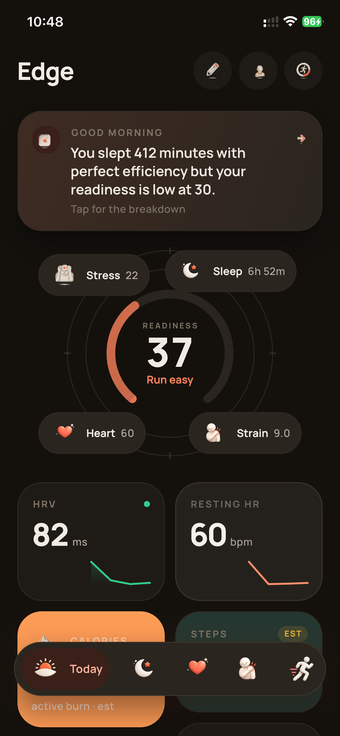<br>**Today** | 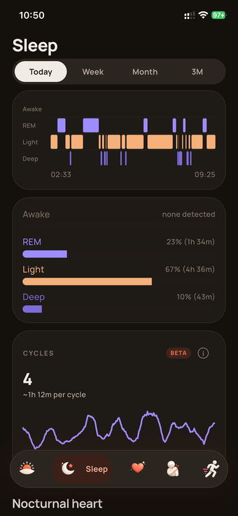<br>**Sleep** | 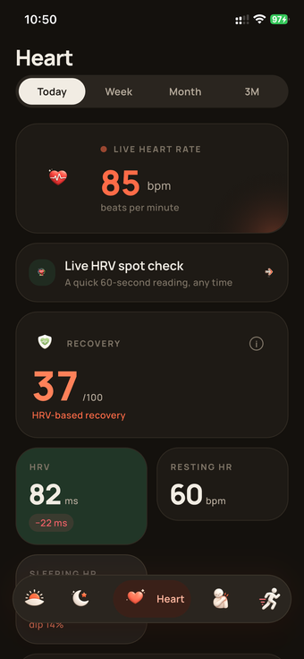<br>**Heart** |
| 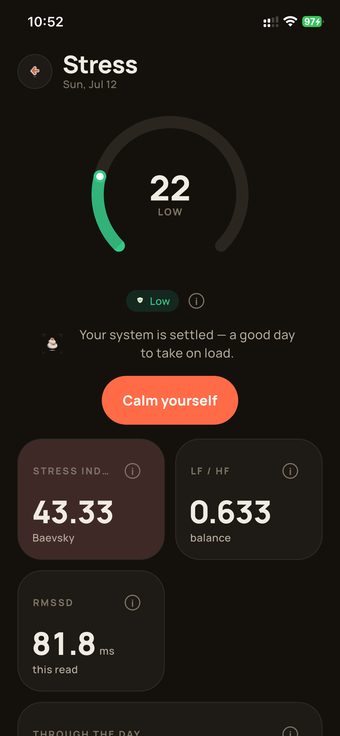<br>**Stress** | 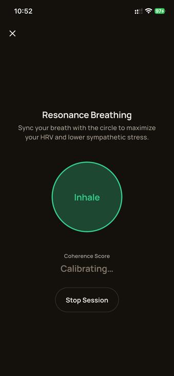<br>**Breathing** | 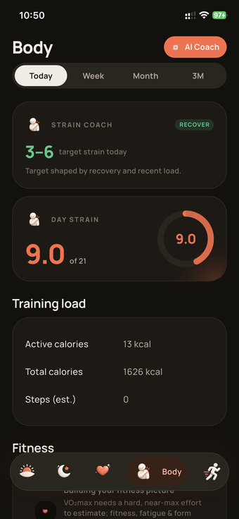<br>**Body** |
| 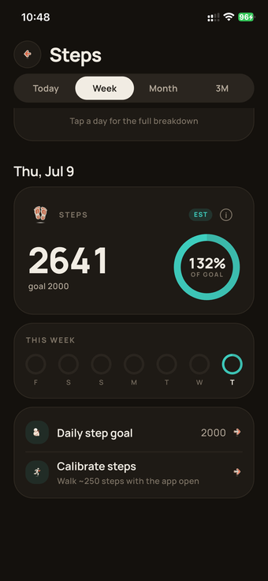<br>**Steps** | 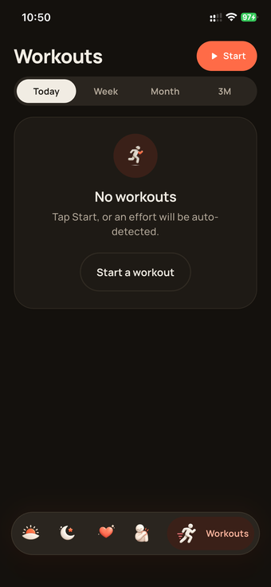<br>**Workouts** | 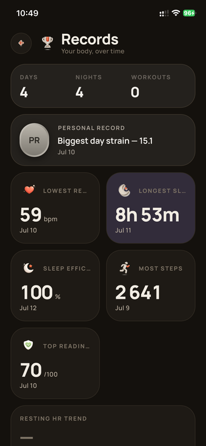<br>**Records** |
| 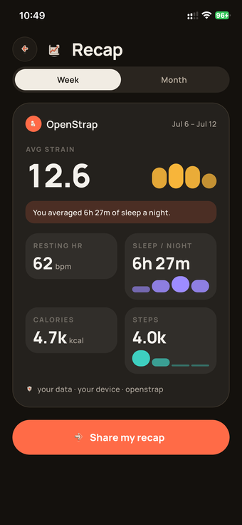<br>**Recap** | 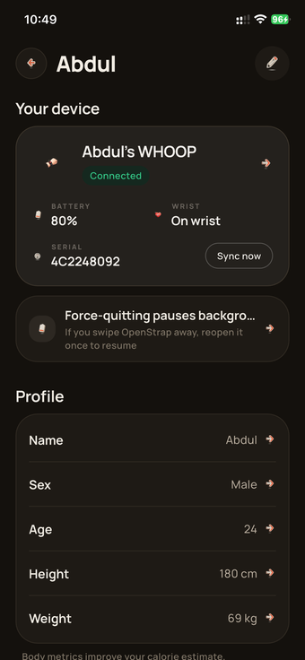<br>**Profile** | |

The full upstream/source-signed iOS profile also gets a home-screen widget, a lock-screen/Dynamic
Island Live Activity, and Siri shortcuts. Akshat's initial personal free-sideload profile excludes
general widgets, App Groups and (from build 81) every app extension: builds 74–80 carried a
workout Live Activity, but Sideloadly's free signing never provisions the extension, so iOS
refused to launch it.

| | | |
|:--:|:--:|:--:|
| 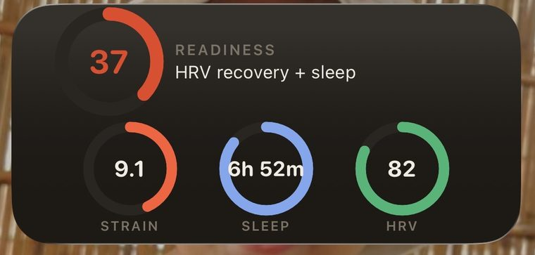<br>**Widget** | 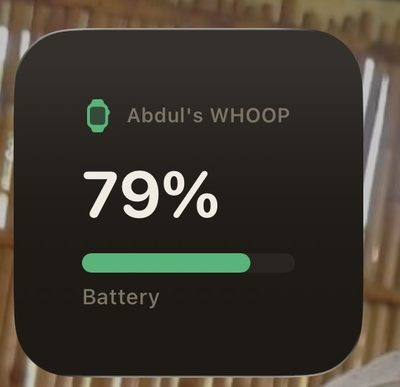<br>**Battery widget** | 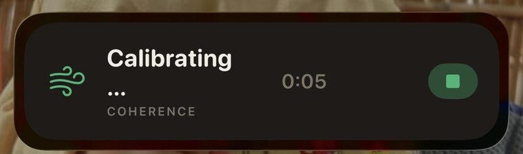<br>**Live Activity** |

Every screenshot above is real output from a WHOOP 4.0.

## Supports

- **WHOOP 4, WHOOP 5, MG** — full support. Everything below is computed from these.
- **Any standard Bluetooth heart-rate strap** — pairs for workout tracking today (heart
  rate + beat timing, stored and shown). Feeding it into recovery/strain is on the roadmap.
- **Oura Ring** — direct-BLE protocol groundwork remains in the upstream-capable codebase. Akshat's
  personal build hides this unsupported, hardware-unverified pairing row.

## What works

**Health** — heart rate, HRV, sleep staging, recovery/readiness, strain, stress, an HRV
spot-check, real-time breathing coherence.

**Activity** — auto-detected workouts, live workout tracking with GPS routes, heart-rate zones.
Current personal build 65 keeps GPS route capture — reopened on Akshat's decision since he runs —
with While-In-Use permission only, never Always. The code is installed but the route/background
device pass remains open; see `CLAUDE.md`.

**Your data, elsewhere** — full upstream builds write to **Apple Health** (HealthKit) and **Google
Health Connect**: sleep stages, resting HR, HRV, respiratory rate, active energy and workouts.
Akshat's initial personal iPhone profile excludes HealthKit until a separate entitlement/install/
refresh experiment passes; manual profile entry and band-derived metrics remain.
Only things the band actually measures — never the derived scores, which have no native
type and would be fabricated. Exports are idempotent, so a day re-deriving never
duplicates samples. You can also export the entire local SQLite database to a file
whenever you like — it's your data, in a format anything can open.

**Background sync** — the band drains without you opening the app. Android runs a
foreground service with a 15-minute watchdog worker and re-attaches via
CompanionDeviceManager. The full iOS source includes processing/refresh tasks and a restore
Bluetooth central. Akshat's personal profile keeps `bluetooth-central` and CoreBluetooth restoration
while removing processing/fetch from the initial artifact; they are never a correctness requirement.

**Everything else in the full source** — trends/history, a journal with on-device correlation insights
("what actually moves your numbers"), cycle tracking, a deterministic coach, a shareable
weekly recap, a BYOK AI assistant, home-screen widgets, iOS Live Activities, Siri
shortcuts, a smart alarm that buzzes the band.

## What doesn't work (yet, or maybe ever)

- iOS background sync is best-effort. It genuinely works (see above), but Apple doesn't
  give third-party apps a real background-service option, so the OS decides when those
  tasks actually run. Syncing while you haven't opened the app in a while is "usually,"
  not "always." Android has no such limit.
- Metrics are approximations off published research — not medical-grade, not validated
  against a lab, don't treat any of it as a diagnosis.
- Upstream iOS is a public TestFlight beta and Android is an APK from Releases. Akshat's personal
  iPhone flavor has a validated unsigned source artifact and an installed Sideloadly-signed copy.
  History/data restore, signed identity, pairing preservation, exact-ID overwrite, and a controlled
  forced-due Wi-Fi daemon refresh are verified; remaining device behavior is tracked above.
- WHOOP 5 and MG support is newer than 4.0's and hasn't had as many bands, firmwares,
  and daily hours put on it. Expect the occasional rough edge, and open an issue when
  you hit one.

## Run it

```bash
git clone https://github.com/OpenStrap/edge.git
cd edge
cp .env.example .env
flutter pub get
flutter run --dart-define-from-file=.env
```

Quit the official WHOOP app before you pair — Bluetooth only lets one app own the band at
a time. `guides/IOS_INSTALLATION.md` separates the accepted minimal personal profile from the
full App Group/widget/Live Activity/Watch source-signed profile.

## How it works

```
wearable → Bluetooth → protocol decoder → local storage → analytics → the UI
```

- `openstrap_protocol` turns bytes off the band into records.
- `openstrap_analytics` turns those records into metrics, each with its own confidence
  score attached — nothing gets faked when the data isn't there.
- this repo is the glue: Bluetooth reliability, local storage (versioned, so an algorithm
  update never silently overwrites old results), background sync, the UI.
- everything that matters stays on the phone.

## Complex Bluetooth protocol

The band doesn't have a normal documented API — it's a proprietary protocol, and getting
it to behave reliably took a while. Short version: the clock ships unset (skip setting it
and every timestamp comes out garbage), history comes off in batches that need an exact
8-byte token echoed back or the band just re-sends the same data forever, and the local
save has to happen before that acknowledgement goes out, not after, so a crash mid-sync
can't lose anything.

The full blow-by-blow lives in the [protocol repo's
README](https://github.com/OpenStrap/protocol) — genuinely the more interesting read if
you're into this kind of thing.

## Your data stays on your phone

Everything's computed and stored locally. No cloud account required, no backend this
needs to work day to day. **Your health data never leaves the device unless you
explicitly send it somewhere.**

Being precise about the network, since "no cloud" gets said too loosely. Nothing below
is required for the app to work, and none of it carries health data except the two you
turn on yourself:

- **Anonymous diagnostics** (Firebase crash/performance). **Off by default in every
  build** — nothing is collected until you turn it on in your profile, and switching
  it back off stops collection immediately. Never includes health data.
- **OTA/announcement pointer** — checks whether there's a newer build.
- **Legacy account import** — one-time, only if you had an old OpenStrap cloud account.
- **BYOK AI assistant** — only if you configure a provider. Your key, your account. Be
  aware that **the prompts contain your health data**: to answer "why is my recovery
  low", the assistant is given your metrics to read. That data goes to whichever
  provider you chose, under their policies, not ours.
- **Health-data contribution** — opt-in, off by default, GitHub builds only. Uploads
  your local database wholesale, which is the entire point of it. It's the only thing
  here that sends the whole database rather than a slice.

Full detail in [PRIVACY.md](PRIVACY.md).

## Repo layout

```
lib/ai/        BYOK AI assistant — briefings, journal AI, nightly sweep
lib/ble/       Bluetooth link + history-sync state machine
lib/cloud/     optional companion/backend + cloud import clients
lib/coach/     read-only SQL coach over allow-listed views
lib/compute/   runs the analytics pipeline, writes results
lib/data/      local storage + the repository seam the UI reads from
lib/debug/     debug-mode flags
lib/gestures/  device action / gesture dispatch
lib/gps/       GPS route tracking for outdoor activities
lib/health/    HealthKit / Health Connect import + export
lib/import/    backup + third-party data import
lib/l10n/      translations (.arb)
lib/live/      Live Activity / breathing session
lib/models/    shared data models (Metric, payloads, app status)
lib/notify/    the single notification emitter + alert policies
lib/platform/  platform-channel glue (app icon, Tasker, device actions)
lib/state/     AppState, the one source of truth
lib/stress/    guided-breathing session logic
lib/sync/      background/headless sync policies
lib/telemetry/ opt-in error + usage telemetry
lib/theme/     design tokens, theming, transitions
lib/ui2/       every screen
lib/widget/    App-Group snapshot for the home-screen/watch widget
```

See `CLAUDE.md` under “Engineering architecture, invariants, and review guidance” for the full
architecture map, invariants, and the biggest files by ownership.

Protocol decoding and analytics live in their own repos —
[protocol](https://github.com/OpenStrap/protocol),
[analytics](https://github.com/OpenStrap/analytics).

## Guides

- [`guides/IOS_INSTALLATION.md`](guides/IOS_INSTALLATION.md) — minimal personal versus full
  source-signed iOS build profiles.
- [`guides/IOS_SIDELOAD.md`](guides/IOS_SIDELOAD.md) — Akshat's direct Windows Sideloadly install,
  refresh, backup, and recovery plan.
- [`guides/WATCH_SETUP.md`](guides/WATCH_SETUP.md) — the Apple Watch companion app.
- [`guides/AI_COACH.md`](guides/AI_COACH.md) — bring-your-own-key AI coach, briefings, and journal.
- [`guides/TASKER_INTEGRATION.md`](guides/TASKER_INTEGRATION.md) — buzzing the strap from Tasker/automation.
- [`guides/BUZZ_MEANINGS.md`](guides/BUZZ_MEANINGS.md) — what each buzz pattern means.

## Community

[Discord](https://discord.gg/dUXds5MWkd) — for questions, band-specific quirks, and
bug reports that don't need a full issue yet.

## Contributing

Found something broken? Open an issue. Found something broken and fixed it? Even better,
send the PR. Protocol-level stuff (new record types, opcodes) belongs in the protocol
repo, metric/formula changes belong in analytics, anything about the app itself —
Bluetooth, storage, UI — belongs here.

[**CONTRIBUTING.md**](CONTRIBUTING.md) has the details: which repo a change belongs in,
how to run the three packages together locally, and the two rules that matter most —
never fabricate a number when the data isn't there, and cite the published method you're
implementing.

Security problems shouldn't go in a public issue — see [SECURITY.md](SECURITY.md) for
private reporting.
